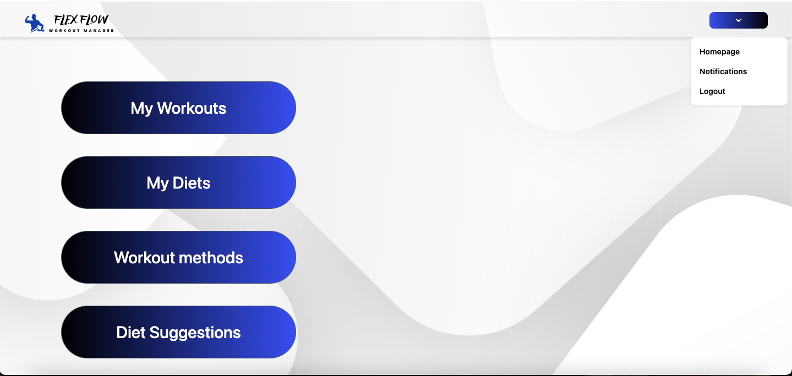
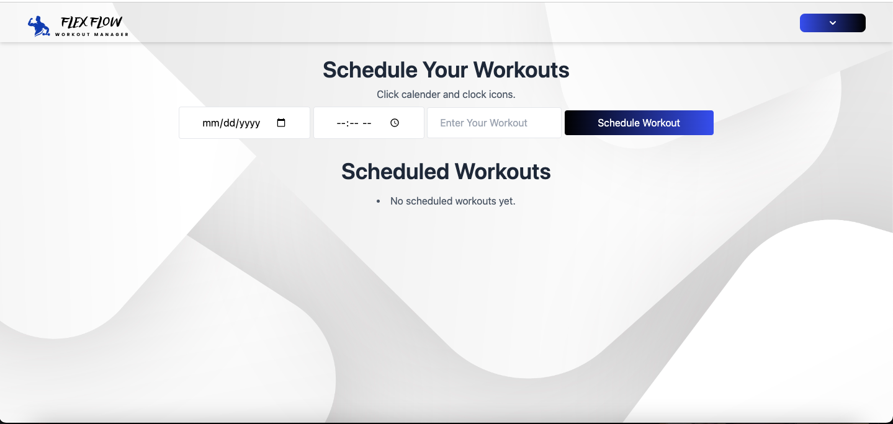
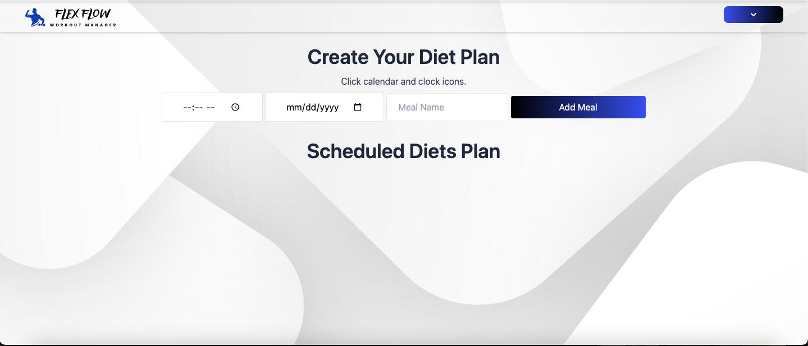
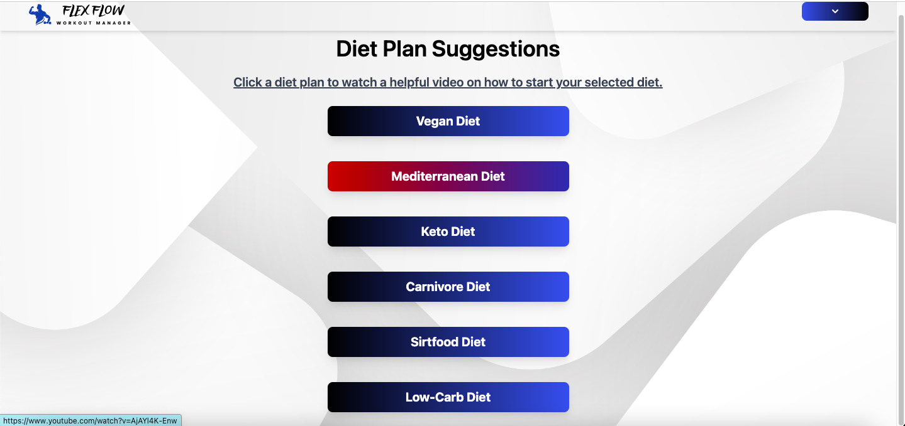
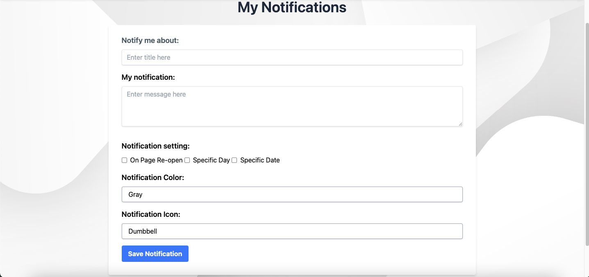

# Flex-Flow 💪

## Table of Contents
 * [Description](#Description)
 * [User-Story](#User-Story)
 * [Website-Link](#Website-Link)
 * [Presentation](#Presentation)
 * [Installation](#Installation)
 * [Usage](#Usage)
 * [Collaboration](#Collaboration)
 * [License](#License)

## Description 
Welcome Flex Flow! This is a full-stack workout manager application. Imagine you’re looking for ways to get in shape but don’t have time to go to a gym. Flex flow allows you create your workout plan & diet right at the comfort of your device. Flex flow will also send you notifications  reminders of your workout plan, encouraging and motivating to keep pushing on your fitness journey.  Dwayne Johnson or a glorious Dad bod, your choice, anything’s possible with FlexFlow. Whether you’re a kick boxer, soccer player, any other athlete, or just a person trying to get in shape, Flex Flow has you covered.

## User-Story
As a user I want a simple and easy to use app to log my workouts so I can keep track of my progress as I get stronger.

## Website-Link
Click the Heroku app link to view the application's website. 

(https://workoutmanagerflexflow-c7e5c5afbfc1.herokuapp.com/login)

## Presentation
Click the link below to view our group presentation.

https://docs.google.com/presentation/d/1EWoO_AF_Dt8A9lmqulHeUAsm7eUBmJ50VrDJap7W3Bc/edit#slide=id.g2b5c8527660_0_0

## Installation
Clone project. Run the following line of code in your terminal to install all the needed packages:[express-handlebars], [MySQL2], [Sequelize], [dotenv package], [bcrypt package], [express], [express-session],[awesome-notifications] and [connect-session-sequelize] 

npm i

## Usage 
To use this app create an account to login, then add your own workouts and diets.

## Collaboration
The contributors for this project are Devonte Miller, Grant Williams, Tina Humphrey, and Claudio Castrillo.
 
## License
This project uses a MIT license 

